# SIF Sentinel — Technical Details and Application Workflow

This document describes the SIF Sentinel application as implemented in this repository. It is intended for developers, reviewers, HSE stakeholders, and anyone operating the SIH26165 demonstration.

The application is a human-reviewed safety-intelligence workbench. It accepts safety-report narratives, performs frozen SIF screening, extracts safety signals, maps supported IOGP Life-Saving Rules, retrieves grounded evidence and similar historical reports, calculates operational analytics, and records operational human-review dispositions.

The system is a prototype. A model score is an uncalibrated screening signal, not an accident probability. The application must not approve work, replace safety procedures, or replace qualified HSE review.

## 1. Architecture at a glance

```text
Browser
  └─ Next.js 15 / React 19 client workbench
       ├─ Supabase browser session and username login
       └─ Authenticated HTTP client
            └─ FastAPI application API
                 ├─ Bearer-token and reviewer-role authorization
                 ├─ Frozen SIF v0.1 classifier adapter
                 ├─ Supplemental deterministic extraction engine
                 ├─ Frozen/offline IOGP LSR multilabel mapper
                 ├─ Grounded TF-IDF reference and historical retrieval
                 ├─ Deterministic evidence explanation service
                 ├─ Analytics and review lifecycle
                 └─ Database repository boundary
                      ├─ Supabase PostgreSQL in configured deployments
                      └─ SQLite compatibility database for local/demo/test use
```

### Main implementation locations

| Responsibility | Implementation |
| --- | --- |
| Frontend shell, pages, input, charts, review controls | `01-app/frontend/components/workbench.tsx` |
| Browser API client and error/session handling | `01-app/frontend/lib/api.ts` |
| Supabase browser client | `01-app/frontend/lib/supabase.ts` |
| Supabase username-to-email helper | `01-app/frontend/lib/auth.ts` |
| FastAPI application and endpoint orchestration | `01-app/backend/app/main.py` |
| Supabase token verification and roles | `01-app/backend/app/auth.py` |
| SQLite/PostgreSQL repository implementations | `01-app/backend/app/services/database.py` |
| Frozen SIF inference adapter | `01-app/backend/app/services/classifier.py` |
| Deterministic extraction and legacy rules engine | `01-app/backend/app/services/engine.py` |
| IOGP Life-Saving Rule model and evidence rendering | `01-app/backend/app/services/domain_model.py` |
| Curated concept nomination | `01-app/backend/app/services/lsr_concepts.py` |
| Reference and historical retrieval | `01-app/backend/app/services/retrieval.py` |
| Offline explanation template | `01-app/backend/app/services/local_llm.py` |
| SQL schema, RLS, review RPC | `supabase/migrations/` |
| Frozen ML artifacts and predictor | `03-training/ml/sif_v0_1/` |

## 2. End-to-end application workflow

The following flowchart shows the normal path from login to report analysis, persistence, analytics, and review. The failure paths are intentionally explicit: authentication fails closed, inference failure routes to human review, unavailable retrieval is shown as unavailable, and unsupported LSR rules are not treated as negative evidence.

```mermaid
flowchart TD
    A[Open SIF Sentinel] --> B{Supabase browser session exists?}
    B -- No --> C[Enter User ID and password]
    C --> D[Normalize User ID and map to internal email]
    D --> E[Supabase signInWithPassword]
    E --> F{Authentication succeeds?}
    F -- No --> C
    F -- Yes --> G[Authenticated Next.js workbench]
    B -- Yes --> G

    G --> H{Choose a workflow}
    H --> I[Paste narrative and metadata]
    H --> J[Upload TXT, CSV, or XLSX]
    H --> K[Open dashboard, incidents, intelligence, sites, activities, alerts, or review queue]

    J --> L[Browser validates file size, extension, row count, and narrative fields]
    L --> M[Parse first CSV/XLSX sheet into report objects]
    M --> N[POST /analyze/batch]
    I --> O[POST /analyze]

    N --> P[FastAPI bearer middleware]
    O --> P
    P --> Q{Valid Supabase token and profile?}
    Q -- No --> R[401 Authentication required]
    Q -- Yes --> S[Validate Pydantic request contract]
    S --> T{Existing report ID or normalized narrative/site duplicate?}
    T -- Duplicate --> U[Return existing report or skip duplicate row]
    T -- New --> V[Deterministic extraction engine]
    V --> W[Frozen SIF classifier screening]
    W --> X{Raw score and model output valid?}
    X -- No --> Y[Null score; HUMAN_REVIEW; inference failure recorded]
    X -- Yes --> Z{Score band}
    Z -- score < 0.35 --> AA[NON_SIF_POTENTIAL / Low / monitor]
    Z -- 0.35 to 0.45 inclusive --> AB[HUMAN_REVIEW / Medium / review required]
    Z -- score > 0.45 --> AC[SIF_POTENTIAL / High / immediate attention]
    Y --> AD[IOGP LSR multilabel mapping]
    AA --> AD
    AB --> AD
    AC --> AD
    AD --> AE[Assign only when rule score and narrative evidence support assignment]
    AE --> AF[TF-IDF grounded reference and historical retrieval]
    AF --> AG[Assemble analysis JSON with provenance and artifact identities]
    AG --> AH[Persist incident and analysis snapshot]
    AH --> AI[Return report detail or batch summary]
    AI --> AJ[Display score, evidence, mapping, similar reports, and review status]

    K --> AK[GET dashboard, analytics, incidents, model, alerts, or reviews]
    AK --> AL[Read persisted reports through FastAPI repository]
    AL --> AM[Calculate trends, density, clusters, risk indexes, and dispositions]
    AM --> AN[Render operational dashboard]

    AJ --> AO{Human review required or reviewer chooses to review?}
    AO -- No --> AP[Retain model outcome as model screening result]
    AO -- Yes --> AQ[Reviewer selects Confirm SIF, Confirm Non-SIF, or Escalate / Unsure]
    AQ --> AR{Reviewer authorized and identity valid?}
    AR -- No --> AS[403/422; no review mutation]
    AR -- Yes --> AT[Atomic incident update plus append-only review history]
    AT --> AU[Expose human outcome separately from model outcome]
    AU --> AN

    AJ --> AV[Request deterministic evidence explanation]
    AV --> AW[Compose summary from stored retrieved evidence]
    AW --> AX[Persist explanation without changing screening or review]
```



## 3. Frontend implementation

### Technology and structure

- Next.js 15 with the App Router, TypeScript 5.7, and React 19.
- `Workbench` is a client component that protects the workspace, observes Supabase auth state, and selects the rendered view from `usePathname()`.
- Lucide supplies functional interface icons.
- Recharts supplies dashboard and entity-detail SVG charts.
- `xlsx` parses CSV and XLSX uploads in the browser; the backend receives normalized JSON rather than the original file.
- Styling is custom CSS in `01-app/frontend/app/globals.css`. The layout is desktop-first and reflows to a mobile navigation bar below 760px.
- `reactStrictMode` is enabled. The production build is run with `next build`, then served with `next start` by the Windows launcher.

### Routes and behavior

| Route | Purpose | Main API calls |
| --- | --- | --- |
| `/login` | User ID/password login through Supabase Auth | Supabase Auth only |
| `/` | Overview metrics, trends, risk distribution, sites, clusters, alerts | `GET /dashboard/summary` |
| `/analyze` | Manual narrative analysis and TXT/CSV/XLSX import | `POST /analyze`, `POST /analyze/batch` |
| `/analyze/:id` | Newly analysed report detail | `GET /incidents/:id` |
| `/intelligence` | Recurring precursor groups and site index | `GET /analytics/clusters`, `GET /analytics/sites` |
| `/sites` and `/sites/:site` | Site ranking and site detail | `GET /analytics/sites`, `GET /analytics/sites/:site` |
| `/activities` and `/activities/:activity` | Activity ranking and activity detail | `GET /analytics/activities`, `GET /analytics/activities/:activity` |
| `/incidents` and `/incidents/:id` | Searchable report register and report detail | `GET /incidents`, `GET /incidents/:id` |
| `/reviews` | Actionable review queue | `GET /reviews` |
| `/alerts` | Existing alert records and status updates | `GET /alerts`, `PATCH /alerts/:id` |
| `/model` | Model identity, hashes, thresholds, coverage, evaluation status | `GET /model` |
| `/settings` | Prototype screening configuration display | `GET /model` |
| `/methodology` | Scope, limitations, and safety disclaimers | `GET /health` is not needed for the static section |

### Session and API behavior

1. The login form accepts a user-facing User ID.
2. The browser normalizes it and maps it to `<normalized>@users.sif-sentinel.invalid`.
3. Supabase Auth creates or restores the browser session, with persistence and token refresh enabled.
4. Every API request calls `supabase.auth.getSession()` and adds `Authorization: Bearer <access_token>`.
5. `GET` requests use `cache: no-store`, so operational pages read current API state.
6. A 401 response signs the browser out and redirects to `/login`.
7. Validation errors are converted into readable field messages; server errors are shown as a temporary service-unavailable message.
8. `NEXT_PUBLIC_API_URL` is the API base URL. It defaults to `/api` in the client helper, but the supported local/deployed configuration sets it directly to the FastAPI origin because no Next.js rewrite is configured.

### Input limits

- Narrative length: at least 12 non-whitespace characters after trimming, and no more than 20,000 total characters as enforced by the frontend and Pydantic backend contract.
- Browser upload size: 5 MB.
- Batch size: 1 to 500 report objects.
- Supported file paths: `.txt`, `.csv`, `.xlsx`.
- CSV/XLSX parsing uses the first worksheet and requires a `narrative` column, case variants accepted by the browser importer. Optional columns are `site`, `activity`, `report_type`, `report_id`, and `source`.
- TXT upload fills the narrative editor; it is submitted through the single-report endpoint.
- PDF is not part of the supported demo upload path.

## 4. Backend API and security boundary

FastAPI is the only application/business API. The browser does not read or write incident, alert, or review-history tables directly.

### Authentication middleware

- `OPTIONS` requests are allowed through for CORS preflight.
- `/live`, `/health`, and `/ready` are public health paths.
- All other paths require a bearer token.
- The backend verifies the token against Supabase Auth using the publishable key, then resolves the user profile using the server-only database key.
- A valid profile becomes an `AuthenticatedUser` containing the Supabase user ID, username, display name, and role.
- Review mutation additionally requires the `reviewer` or `admin` role.
- The test-only bypass is enabled only when `SIF_TEST_AUTH_BYPASS` is set and `SIF_ENVIRONMENT` is `test` or `testing`.

### CORS

`CORS_ORIGINS` and `FRONTEND_URL` are parsed as comma-separated origins, trailing slashes are normalized, invalid origins are ignored, credentials are enabled, and wildcard `*` is not used with credentials.

### Endpoint reference

All endpoints below are authenticated unless marked public.

| Method | Endpoint | Behavior |
| --- | --- | --- |
| `GET` | `/live` public | Returns liveness `{status: "alive"}`. |
| `GET` | `/health` public | Returns readiness payload; 200 when all required dependencies are ready, otherwise 503. |
| `GET` | `/ready` public | Alias of `/health`, used by Render health checks. |
| `POST` | `/analyze` | Validates, de-duplicates, analyses, persists, and returns one report. |
| `POST` | `/analyze/batch` | Screens/maps a batch, de-duplicates, persists new rows, and returns counts plus per-row results. |
| `GET` | `/incidents` | Paged report list with search, site, activity, risk, review, and source filters. |
| `GET` | `/incidents/{id}` | One report with normalized outcome fields, review history, similarity results, and provenance. |
| `GET` | `/incidents/{id}/similar` | Similar historical reports for one report. |
| `POST` | `/incidents/{id}/intelligence` | Adds or refreshes the deterministic retrieved-evidence explanation. |
| `GET` | `/dashboard/summary` | Returns overview metrics, six weekly trend points, distributions, ranked sites/activities, and precursor clusters. |
| `GET` | `/analytics/sites` | Site-level counts, density, index, trend, and disposition counts. |
| `GET` | `/analytics/sites/{site}` | Site summary, reports, rules, activities, trend, and emerging pattern. |
| `GET` | `/analytics/activities` | Activity-level counts and rankings. |
| `GET` | `/analytics/activities/{activity}` | Activity summary, reports, sites, rules, and trend. |
| `GET` | `/analytics/rules` | Rule counts with provenance. |
| `GET` | `/analytics/trends` | Six weekly high-risk/review trend points. |
| `GET` | `/analytics/clusters` | Recurring precursor groups, affected sites, percentages, and trends. |
| `GET` | `/reviews` | Reports whose stored review status is `Pending` or `Escalated`. |
| `POST` | `/reviews/{id}` | Applies an operational human-review disposition and appends history. |
| `GET` | `/alerts` | Returns stored alert rows. |
| `PATCH` | `/alerts/{id}` | Changes alert status to `New`, `Acknowledged`, or `Resolved`. |
| `GET` | `/model` | Returns active SIF/LSR metadata, hashes, thresholds, coverage, and evaluation caveats. |

## 5. Analysis pipeline

### 5.1 Request validation and identity

`AnalyzeInput` accepts:

```json
{
  "narrative": "required safety report text",
  "site": "optional site; defaults to Unspecified",
  "activity": "optional activity",
  "report_type": "Unsafe Act | Unsafe Condition | Near Miss | Incident | Unspecified",
  "report_id": "optional source identifier",
  "source": "optional provenance/source label"
}
```

The backend strips the narrative and rejects fewer than 12 meaningful characters. It rejects unsupported report types. The single-report endpoint checks for an existing row with the same normalized narrative and site. The batch endpoint additionally detects repeated report IDs and repeated narrative/site keys within the upload.

If no ID is supplied, a new ID has the form `ANL-<8 uppercase SHA-1 hex characters>`, where the digest includes the narrative and the current timestamp. Imported IDs are preserved.

### 5.2 Supplemental deterministic extraction

`services/engine.py` performs transparent, non-authoritative extraction:

- Life-Saving Rule cue matching for energy isolation, line of fire, working at height, safe mechanical lifting, driving, confined space, hot work, work authorisation, and bypassing safety controls.
- Hazard extraction for stored energy, line-of-fire exposure, mechanical lifting, fall exposure, vehicle movement, toxic atmosphere, and fire/explosion.
- Activity extraction for valve maintenance, mechanical lifting, drilling, driving, hot work, pressure testing, and inspection.
- Basic location extraction using phrases beginning with `at`, `in`, or `on` followed by a site/facility/plant/yard/platform/rig/station/terminal phrase.
- Precursor extraction for isolation-verification gaps, line-of-fire exposure, and permit/critical-control deviation.
- Explicit barrier-failure extraction and weaker barrier-control-topic candidates.
- Evidence phrases and a note that the signals are not proof of causation.

The engine still contains a legacy transparent rules score for compatibility. In the active path, `analyze_with_classifier()` replaces the SIF classification/risk/review fields with the frozen classifier result. The rules engine cannot override the frozen SIF screen.

### 5.3 Frozen SIF classifier

The active adapter is `FrozenClassifierAdapter` in `services/classifier.py`.

- Default artifact directory: `03-training/ml/sif_v0_1/artifacts/supervised`.
- `MODEL_PATH` can select another artifact directory; deployment sets it to the copied frozen artifact tree.
- The active supervised model is selected by `threshold.json`.
- Supported predictor identities include `tfidf_word_12_char_35` and `embedding_logreg`; the repository’s selected prototype identity is `tfidf_word_12_char_35`, backed by the runtime’s frozen `tfidf_logreg.joblib` artifact.
- Narrative preprocessing is loaded from the frozen predictor in `03-training/ml/sif_v0_1/src/predict.py`.
- Joblib model objects and metadata are cached in process memory after first use.
- Batch inference vectorizes and scores the batch once when the active artifact supports the optimized path, then falls back to safe per-row scoring if needed.

The score routing contract is:

| Raw score | Decision | Application state |
| --- | --- | --- |
| `< 0.35` | `NON_SIF_POTENTIAL` | `Non-SIF Potential`, Low risk, no required review |
| `0.35–0.45` inclusive | `HUMAN_REVIEW` | `Needs Review`, Medium risk, review required |
| `> 0.45` | `SIF_POTENTIAL` | `SIF Potential`, High risk, immediate attention |

The metadata also exposes `selected_sif_threshold` from the frozen configuration, currently 0.40. The operational three-band routing uses the policy review band boundaries above; the score remains uncalibrated.

Every stored current-model screening includes model identity, model hash, configuration hash, model version, raw score, decision, thresholds, and calibration status. If the artifact is missing/invalid, inference throws, the score is outside `[0, 1]`, or the decision disagrees with the score band, the adapter emits a null score and `HUMAN_REVIEW` with an explicit failure reason.

### 5.4 IOGP Life-Saving Rule mapping

`services/domain_model.py` loads the offline LSR artifact from:

`03-training/ml/sif_v0_1/artifacts/domain_adapted_v0_2/lsr_model.joblib`

The artifact contains a TF-IDF vectorizer and one classifier specification per rule. The mapper evaluates available classifiers and renders each rule with:

- rule ID and name;
- uncalibrated model score;
- assignment and borderline thresholds;
- `ASSIGNED`, `BORDERLINE`, `BELOW_THRESHOLD`, or `UNAVAILABLE` status;
- reason code;
- criterion-aligned evidence excerpt from the submitted narrative;
- `ESTABLISHED` or `NOT_ESTABLISHED` violation status;
- deterministic rendered explanation.

An LSR assignment requires both:

1. the rule score to meet that rule’s assignment threshold; and
2. a supported narrative excerpt to ground the assignment.

Conceptual or glossary matches are not assignments. Negated/safe phrases are filtered locally when selecting supporting excerpts. Unavailable rules are reported as unavailable, never as negative evidence. The mapping stores the artifact hash, model version, reference ID, schema version, coverage flag, and timing fields.

The nine rule IDs are represented by the artifact as LSR01 through LSR09. The runtime documentation and `/model` page report incomplete coverage where applicable; the known unsupported coverage is not converted into a negative classification.

### 5.5 Grounded retrieval

`services/retrieval.py` separates two evidence populations.

#### Public IOGP/reference evidence

- The catalog is `01-app/backend/app/reference/knowledge_catalog.json`.
- Reference and glossary documents are vectorized with scikit-learn `TfidfVectorizer(stop_words="english", ngram_range=(1, 2))`.
- `lsr_concepts.py` nominates relevant concepts using bounded regex patterns and local negation handling.
- Only catalog entries with the required publisher, evidence ID, text, source URL, document version, and page/section fields can become IOGP reference evidence.
- Results include a citation object, excerpt, narrative spans, corpus version, retrieval method, and relevance score.
- Glossary entries can be returned as `oil_glossary` context when cosine relevance is at least 0.08.
- Reference retrieval is context and citation, not proof that a rule was violated.

#### Historical report similarity

- Candidate narratives are ranked with per-query TF-IDF cosine similarity using word 1–2 grams.
- Results must meet the 0.12 minimum relevance threshold.
- The current report ID and current source ID are excluded.
- Candidates are de-duplicated by source ID and normalized narrative.
- Locked sources and locked record flags are excluded using `validation_policy.json`.
- Each result preserves incident ID, source ID, excerpt, relevance, retrieval method, corpus version, and label provenance.
- This is local lexical similarity, not semantic embedding retrieval.

Retrieval errors produce an explicit `retrieval_unavailable` status while preserving the classifier result. They do not change a positive result into a negative result.

### 5.6 Deterministic evidence explanation

`services/local_llm.py` intentionally does not call a generative model or network service. It uses prompt/version label `deterministic-evidence-template-v2` and combines up to five already-grounded reference or historical evidence items into a text summary.

The explanation stores:

- status and completion status;
- generated text from the deterministic template;
- cited evidence IDs;
- no LLM model name;
- prompt version;
- zero runtime generative calls;
- cache-hit and latency fields for compatibility.

The UI can request `POST /incidents/{id}/intelligence` to refresh this summary. It cannot change the SIF screening, LSR assignment, or human outcome.

## 6. Stored data and persistence

### Database selection

`services/database.py` selects the repository once per process:

- If `SUPABASE_URL` and `SUPABASE_SECRET_KEY` are configured, it uses Supabase PostgreSQL through the REST API and a protected RPC for reviews.
- Otherwise, it uses a SQLite compatibility repository. The default local database is `01-app/backend/data/sif_sentinel.db`; if absent, it is copied from `sif_sentinel.seed.db`.
- Tests can reset the repository singleton and use the SQLite compatibility schema.

### Incident record

The primary `incidents` record contains:

```text
id, report_date, site, activity, report_type, narrative,
source, source_id, normalized_narrative, import_batch_id,
sif_probability, risk, high_potential, sif_potential,
sif_label_status, analysis,
review_status, reviewer, review_comment,
created_at, created_by_user_id
```

`analysis` is JSON text in SQLite and JSONB in PostgreSQL. The nested analysis stores the classifier screen, deterministic extraction, LSR mapping, retrieval snapshot, artifact versions, and explanation where requested.

### Normalized API outcome fields

The `out()` adapter adds derived fields without rewriting the stored analysis:

- `model_outcome`: `SIF Potential`, `Non-SIF Potential`, or `Needs Review` from the stored screening decision.
- `human_outcome`: operational review disposition derived from review status and stored label.
- `review_requirement`: `required` only for `Pending` or `Escalated` rows.
- `effective_outcome`: human outcome when present; otherwise `Pending human review` for actionable rows; otherwise the model outcome.
- `provenance`: current-model, partial, or legacy classification plus stored model/LSR identity.
- `formal_evaluation_eligible`: always false for operational API records.
- `human_review_provenance`: `operational_human_review` when a disposition exists.

Legacy or partial rows are displayed and retained for continuity. They are not silently re-scored with the currently loaded artifact and are excluded from current-model performance interpretation.

### Supabase security model

The SQL migrations create:

- `profiles`, linked to `auth.users`, with unique username and `demo`, `reviewer`, or `admin` role;
- `incidents` with indexes for date, site, activity, review status, SIF state, source ID, normalized narrative, and import batch;
- `alerts` with status/date indexing;
- `review_history` with reviewer identity, outcome transition, timestamp, comment, and screening version.

Row-level security is enabled on all tables. Browser-authenticated clients receive a select policy only for their own profile. There is no browser read/write policy for incidents, alerts, or review history; FastAPI performs authorization and uses the server-only Supabase secret key.

The `apply_incident_review` security-definer function updates the incident and inserts the review-history row in one server-side operation. The identity-sync function aligns the review-history identity sequence after imports. The browser cannot execute either function.

## 7. Analytics and operational views

All analytics are calculated from the stored workspace rows by `main.py`. They are operational prototype indicators, not official model metrics.

### Dashboard metrics

The overview returns:

- reports analyzed;
- model-positive screenings;
- pending required reviews;
- unreviewed automatic positives;
- confirmed SIF and confirmed Non-SIF operational dispositions;
- unresolved/escalated cases;
- high-risk sites;
- operational risk index;
- high/medium/low risk distribution;
- six weekly trend points;
- top sites, activities, rules, and precursor clusters;
- the first stored alert title, when alerts exist.

Historical/partial records remain in operational totals, while current-model compatibility is counted separately.

### Trend calculation

The report with the latest `report_date` anchors six consecutive seven-day windows. Each point contains:

- `high`: number of rows with `risk == "High"`;
- `reviews`: number of rows still requiring human review.

### Site and activity statistics

For a site:

```text
sif_precursor_density = 100 × model-positive screenings / total reports
score_signal = mean(non-null raw model scores)
risk_index = min(100,
  round((high-risk fraction × 55 + score_signal × 45) × 1.65
        + pending-review count × 0.7))
```

Sites are sorted by density, then report count. The dashboard marks a site high risk when `risk_index >= 58`.

For an activity, the prototype risk index is `mean(raw model score) × 100`, capped at 100 by the implementation. Both views expose model-positive, confirmed human, effective-positive, pending, and unresolved dispositions separately.

### Recurring precursor clusters

Rows are grouped by extracted precursor, excluding `no strong precursor pattern`. For each group the API returns count, affected sites, leading activities, model-positive percentage, effective-positive percentage, representative incident IDs, and a trend:

- `Rising` when the recent 30-day count exceeds the previous 30-day count;
- `Declining` when it is lower;
- `Stable` otherwise.

A keyword/rule candidate is explicitly marked `unverified_keyword_candidate` and is not presented as an authoritative assignment.

## 8. Operational human review

The review UI is a disposition workflow, not the official blind-validation evaluator.

### Review request

`POST /reviews/{incident_id}` accepts:

```json
{
  "outcome": "Confirm SIF | Confirm Non-SIF | Escalate / Unsure",
  "reviewer": "optional when authenticated profile identity is available",
  "comment": "optional comment, maximum 2000 characters"
}
```

The backend:

1. validates the outcome alias;
2. requires `reviewer` or `admin` role when a user is authenticated;
3. requires an identity of at least two characters;
4. loads the current incident and previous human outcome;
5. maps the outcome to `Reviewed` or `Escalated` status;
6. sets `sif_potential` to 1, 0, or null;
7. labels the row as `operational_human_reviewed` or `operational_unresolved`;
8. stores reviewer identity, comment, timestamp, previous/new outcome, and screening version;
9. atomically updates the incident and appends review history;
10. returns the refreshed incident detail.

The UI and API keep model outcome, human outcome, and effective outcome separate. Operational review rows are never treated as formal blind-test ground truth by this application.

## 9. Model governance and frozen validation boundary

The operational app consumes frozen artifacts; it does not train, calibrate, choose a threshold, or select a model at runtime.

The repository’s human-validation workflow is separate from the operational review UI:

- `blind_test_v0_2` is a frozen historical human-validation release.
- `blind_test_v0_3` is the official release candidate; its blank packet and freeze manifest are immutable.
- Finalization and attestation artifacts are the only artifacts that can become official after review.
- Reviewer packets must not contain predictions, model scores, AI labels, retrieval results, or explanations before adjudication is locked.
- Blind membership is controlled by the canonical freeze manifest.
- Blind records must not overlap training, development, calibration, unresolved, or duplicate-linked populations.
- The official evaluator consumes only fixed artifacts and locked adjudications and uses the frozen binary threshold.

The `/model` page intentionally reports that calibration and locked human blind validation are incomplete. Experimental v0.4 candidates are retained for auditability and are not loaded by the application runtime.

## 10. Local execution and deployment

### Local Windows demo

From the repository root:

```powershell
01-app\run-demo.cmd
```

The launcher:

1. loads the uncommitted `01-app/.env` file without printing secrets;
2. checks whether ports 8000 and 3000 already host healthy SIF Sentinel services;
3. creates/uses `backend/.venv` and `frontend/node_modules` when dependencies are missing or changed;
4. starts Uvicorn on `127.0.0.1:8000`;
5. creates a fresh Next.js production build;
6. starts Next.js on `127.0.0.1:3000`;
7. waits for `/health` and `/login` before opening the browser;
8. stores process IDs and logs in `01-app/.run`.

Useful commands:

```powershell
01-app\run-demo.cmd -Install
01-app\run-demo.cmd -Clean
01-app\stop-demo.cmd
01-app\test-project.cmd
```

### Backend container

`01-app/backend/Dockerfile` uses Python 3.12, installs `01-app/backend/requirements.txt`, copies the backend, and copies `03-training` so frozen artifacts are available in the image. It binds Uvicorn to `0.0.0.0:${PORT:-8000}`.

`01-app/render.yaml` configures a Render-style web service with `/ready` health checks and the required Supabase, CORS, frontend, and model-path variables.

### Frontend deployment

The frontend can be deployed from `01-app/frontend` to Vercel or another Node-capable host. Production requires:

```text
NEXT_PUBLIC_SUPABASE_URL
NEXT_PUBLIC_SUPABASE_PUBLISHABLE_KEY
NEXT_PUBLIC_API_URL
```

`NEXT_PUBLIC_API_URL` must be the public FastAPI origin without an endpoint suffix. The deployed frontend origin must be listed in backend `CORS_ORIGINS` and `FRONTEND_URL`. Never expose `SUPABASE_SECRET_KEY` in any `NEXT_PUBLIC_*` variable.

### Environment variables

| Variable | Scope | Purpose |
| --- | --- | --- |
| `SUPABASE_URL` | Backend secret/config | Supabase project URL. |
| `SUPABASE_PUBLISHABLE_KEY` | Backend + frontend public key | Auth user verification and browser Supabase client. |
| `SUPABASE_SECRET_KEY` | Backend secret only | Server-side database access and protected RPC. |
| `CORS_ORIGINS` | Backend | Allowed browser origins, comma-separated. |
| `FRONTEND_URL` | Backend | Primary frontend origin. |
| `MODEL_PATH` | Backend | Optional frozen SIF artifact directory override. |
| `NEXT_PUBLIC_SUPABASE_URL` | Frontend public | Browser Supabase URL. |
| `NEXT_PUBLIC_SUPABASE_PUBLISHABLE_KEY` | Frontend public | Browser Supabase publishable key. |
| `NEXT_PUBLIC_API_URL` | Frontend public | FastAPI base URL. |
| `NEXT_PUBLIC_SHOW_DEMO_CREDENTIALS` | Frontend public | Optional display of `test / test123` hint. |
| `ENABLE_DEMO_USER`, `DEMO_USERNAME`, `DEMO_PASSWORD` | Backend setup | Used by the server-side demo-user seed command. |

## 11. Verification

The relevant checks for this application are:

```powershell
cd 01-app\backend
python -m pytest tests -q

cd ..\frontend
npm run build
```

The backend test suite covers authentication, API contracts, SQLite migration behavior, database behavior, LSR mapping, domain model behavior, and seeded demo-user behavior. The frozen-pipeline tests in `03-training/ml/sif_v0_1/tests` cover artifact and evaluator integrity. The frontend production build catches TypeScript, route, import, and Next.js compilation failures.

For a running deployment, also verify `/live`, `/health`, `/ready`, login, dashboard loading, single analysis, batch import, report detail, similar-report retrieval, evidence explanation, operational review, alert acknowledgement, refresh persistence, logout, and protected-route redirect.

## 12. Current limitations

- The frozen SIF model is an internal supervised prototype, not externally validated or production-approved.
- Scores are uncalibrated and must not be read as probabilities.
- The included public reference corpus is not Oil India operational data and its weak labels are not expert SIF adjudications.
- Similarity is lexical TF-IDF, not semantic retrieval.
- Activity, location, hazard, precursor, and barrier extraction are basic phrase/regex matching.
- Safe/negated or generic language can still create false alarms or ambiguous evidence.
- LSR coverage is incomplete for unsupported rule classifiers; unavailable is not negative.
- The application has a shared demo workspace rather than tenant isolation.
- Authentication and roles are prototype-level and do not provide enterprise SSO/RBAC, secure file handling, notification delivery, immutable enterprise audit controls, or tenant isolation.
- SQLite is suitable for local/demo use, not an operational production database without an approved migration, backup, monitoring, and retention design.
- Stored operational review dispositions do not produce official blind-validation metrics.
- True autonomous alert generation is not configured; the alert page manages stored alert rows.

## 13. Recommended production evolution

Before operational deployment, the project should obtain de-identified operational reports and expert labels; establish time-based held-out evaluation focused on recall and false negatives; run shadow-mode HSE review; add enterprise identity, RBAC, HTTPS, secrets management, immutable audit controls, retention policy, secure uploads, database backups/monitoring, model approval gates, drift monitoring, rollback, and periodic revalidation. Human HSE review must remain mandatory.
